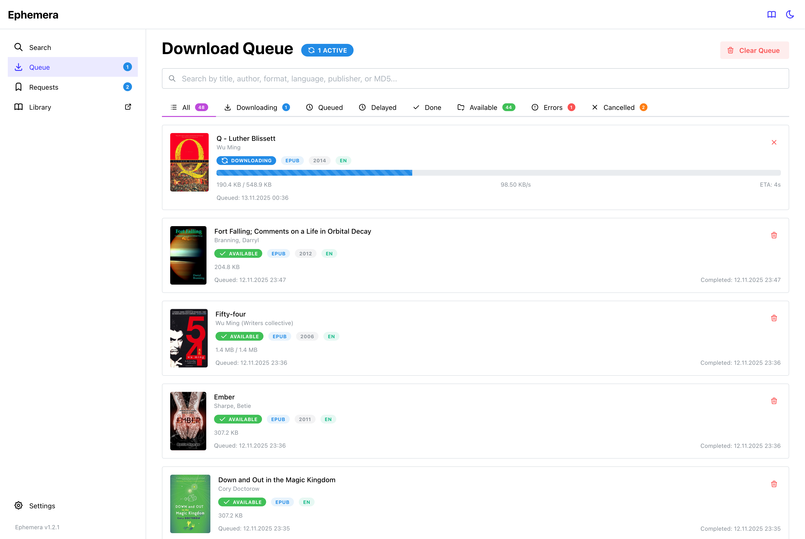
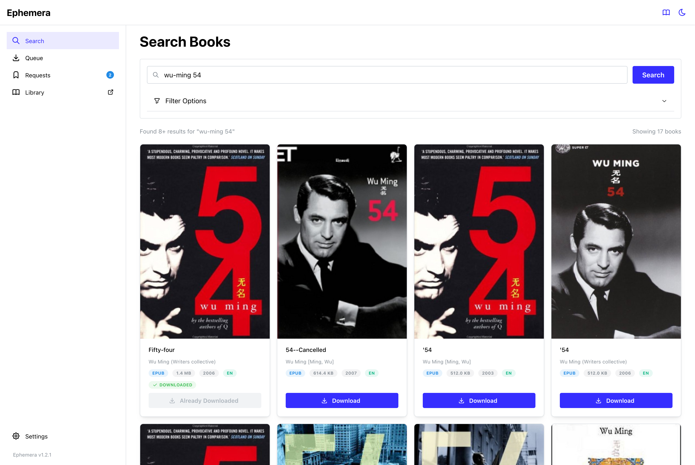

# Ephemera Book Downloader

Search and download books from your girl's favorite archive. Supports auto-move to a [BookLore](https://github.com/booklore-app/booklore) or [Calibre-Web-Automated](https://github.com/crocodilestick/Calibre-Web-Automated) ingest folder or BookLore API upload.

<div class="grid" markdown>






</div>

## Docker setup

### Setup the container using the Docker Compose template below:

```yaml
services:
  ephemera:
    image: ghcr.io/orwellianepilogue/ephemera:latest
    container_name: ephemera
    restart: unless-stopped

    ports:
      - '8286:8286'

    environment:
      # Required:
      AA_BASE_URL:

      # Optional
      AA_API_KEY:
      FLARESOLVERR_URL: http://flaresolverr:8191
      PGID: 1000
      PUID: 1000

    volumes:
      - ./data:/app/data
      - ./downloads:/app/downloads
      - ./ingest:/app/ingest

    # Set DNS server to prevent EU blocking
    #dns:
    #  - 1.1.1.1
    #  - 1.0.0.1

    healthcheck:
      test:
        [
          'CMD',
          'wget',
          '--no-verbose',
          '--tries=1',
          '--spider',
          'http://localhost:8286/health',
        ]
      interval: 30s
      timeout: 10s
      start_period: 40s
      retries: 3

  flaresolverr:
    image: ghcr.io/flaresolverr/flaresolverr:latest
    container_name: flaresolverr
    restart: unless-stopped

    environment:
      - LOG_LEVEL=info
      - LOG_HTML=false
      - CAPTCHA_SOLVER=none
      - TZ=Europe/Berlin

    # Set DNS server to prevent EU blocking
    #dns:
    #  - 1.1.1.1
    #  - 1.0.0.1

    healthcheck:
      test: ['CMD', 'wget', '--spider', '-q', 'http://localhost:8191/health']
      interval: 30s
      timeout: 10s
      start_period: 30s
      retries: 3
```

### Required Environment Variables

Only two variables are required:

| Variable      | Description                    | Example                   |
| ------------- | ------------------------------ | ------------------------- |
| `AA_API_KEY`  | Archive API authentication key | `sk_abc123...`            |
| `AA_BASE_URL` | Base URL of your archive       | `https://yourarchive.org` |

### Optional Environment Variables

All other settings have sensible defaults, but you can override them:

| Variable           | Default                 | Description            |
| ------------------ | ----------------------- | ---------------------- |
| `PORT`             | `8286`                  | Application port       |
| `DB_PATH`          | `/app/data/database.db` | Database location      |
| `DOWNLOAD_FOLDER`  | `/app/downloads`        | Temp download folder   |
| `INGEST_FOLDER`    | `/app/ingest`           | Final books folder     |
| `NODE_ENV`         | `production`            | Node environment       |
| `RETRY_ATTEMPTS`   | `3`                     | Download retries       |
| `REQUEST_TIMEOUT`  | `30000`                 | API timeout (ms)       |
| `SEARCH_CACHE_TTL` | `300`                   | Search cache (seconds) |

## Monorepo Structure

```
ephemera/
├── packages/
│   ├── api/          # Hono API backend with Crawlee scraping
│   ├── shared/       # Shared TypeScript types and API client
│   └── web/          # React frontend with Vite
└── data/             # SQLite database
```

## Development Quick Start

### Prerequisites

- Node.js 22+
- pnpm 9+

### Installation

```bash
# Install all dependencies
pnpm install

# Approve build scripts for native modules
pnpm approve-builds
# Select: better-sqlite3, esbuild

# Copy environment template
cp packages/api/.env.example packages/api/.env

# Edit with your AA API key and url
nano packages/api/.env

# Run migrations
cd packages/api && pnpm db:migrate
```

### Development

```bash
# Run everything (API + Frontend)
pnpm dev

# Or run individually:
pnpm dev:api    # Backend only (http://localhost:8286)
pnpm dev:web    # Frontend only (http://localhost:5173)
```

### Build for Production

```bash
# Build all packages
pnpm build

# Build individually
pnpm build:api
pnpm build:web
```

## Architecture

### Tech Stack

#### Backend (`packages/api`)

- **Framework**: Hono 4.6+ (lightweight, fast, type-safe)
- **Database**: SQLite + Drizzle ORM
- **Scraping**: Crawlee + Cheerio
- **Validation**: Zod schemas
- **OpenAPI**: Swagger UI and auto-generated spec at `http://host:8286/api/docs` & `http://host:8286/api/openapi.json`

#### Frontend (`packages/web`)

- **Framework**: React 18 + TypeScript
- **Build Tool**: Vite 6
- **UI Library**: Mantine UI 7
- **Routing**: TanStack Router v1
- **Data Fetching**: TanStack Query v5
- **Icons**: Tabler Icons

#### Shared (`packages/shared`)

- **Schemas**: Zod validation schemas
- **Types**: TypeScript types (exported from Zod)
- **API Client**: Typed fetch wrapper using OpenAPI types
- **Type Generation**: `openapi-typescript` from live API

### Type Safety

Full end-to-end type safety:

```
API (Zod schemas) → OpenAPI spec → TypeScript types → React frontend
```

Changes to the API automatically propagate to the frontend through:

1. Zod schemas in `packages/shared/src/schemas.ts`
2. Generated OpenAPI types via `openapi-typescript`
3. Type-safe client in `packages/shared/src/client.ts`

## Scripts

### Root-Level Scripts

```bash
pnpm dev              # Run all packages in parallel
pnpm build            # Build all packages
pnpm type-check       # Type-check all packages
pnpm clean            # Clean all build artifacts
```

### API Scripts

```bash
pnpm --filter @ephemera/api dev           # Dev mode with watch
pnpm --filter @ephemera/api build         # Build TypeScript
pnpm --filter @ephemera/api db:generate   # Generate migrations
pnpm --filter @ephemera/api db:migrate    # Run migrations
pnpm --filter @ephemera/api db:studio     # Open Drizzle Studio
```

### Web Scripts

```bash
pnpm --filter @ephemera/web dev           # Dev server with HMR
pnpm --filter @ephemera/web build         # Production build
pnpm --filter @ephemera/web preview       # Preview prod build
```

### Shared Scripts

```bash
pnpm --filter @ephemera/shared build            # Build types
pnpm --filter @ephemera/shared generate:client  # Generate API types
```

## Version Management

This monorepo uses [Changesets](https://github.com/changesets/changesets) for synchronized versioning. All packages (api, web, shared) always share the same version number.

### Quick Release Workflow

1. **Make your changes** and commit them normally
2. **Create a changeset** describing what changed:
   ```bash
   pnpm changeset
   # Follow prompts: select change type (patch/minor/major) and write summary
   ```
3. **When ready to release**, run:
   ```bash
   pnpm release
   # This will: version packages → create git tag → push to trigger Docker build
   ```

### Version Management Scripts

```bash
# Create a changeset (describes your changes)
pnpm changeset

# Check status of pending changesets
pnpm changeset:status

# Apply changesets and update versions + CHANGELOG
pnpm version

# Full release (version → tag → push)
pnpm release

# Individual release steps (if you want more control)
pnpm release:version    # Update package.json + CHANGELOG
pnpm release:tag        # Commit changes and create git tag
pnpm release:push       # Push code and tags to trigger Docker build
```

### How It Works

- **Changesets** track what changed between versions
- **Synchronized versioning**: All packages version together (currently at v1.0.3)
- **Automatic changelog**: Generated from changeset summaries
- **Docker automation**: Pushing a git tag (e.g., `v1.0.4`) triggers the GitHub Action to build and publish a new Docker image

### Example Release Flow

```bash
# 1. After implementing a new feature
git add .
git commit -m "feat: add book metadata export"

# 2. Create a changeset
pnpm changeset
# → Select "minor" (new feature)
# → Enter summary: "Add book metadata export functionality"

# 3. Continue working, create more changesets for other changes
pnpm changeset
# → Select "patch" (bug fix)
# → Enter summary: "Fix download progress bar display"

# 4. When ready to release
pnpm release
# → All changesets consumed
# → package.json versions bumped (e.g., 1.0.3 → 1.1.0)
# → CHANGELOG.md updated
# → Git tag v1.1.0 created
# → Changes pushed to GitHub
# → Docker build triggered automatically
```

### Version Types

- **patch** (1.0.3 → 1.0.4): Bug fixes, minor tweaks
- **minor** (1.0.3 → 1.1.0): New features, backwards-compatible changes
- **major** (1.0.3 → 2.0.0): Breaking changes

## Development Workflow

### 1. Update API Schema

Edit `packages/shared/src/schemas.ts`:

```typescript
export const myNewSchema = z.object({
  id: z.string(),
  name: z.string(),
})
```

### 2. Use in API

```typescript
import { myNewSchema } from '@ephemera/shared'

const route = createRoute({
  request: { body: myNewSchema },
  // ...
})
```

### 3. Regenerate OpenAPI Types

```bash
# Start API first
pnpm dev:api

# In another terminal, generate types
pnpm --filter @ephemera/shared generate:client
```

### 4. Use in Frontend

```typescript
import { client } from '@ephemera/shared'

const data = await client.get('/api/new-endpoint')
// `data` is fully typed!
```

## API Documentation

- **Swagger UI**: http://localhost:8286/api/docs
- **OpenAPI Spec**: http://localhost:8286/api/openapi.json

## Frontend Routes

- `/` - Search books
- `/queue` - Download queue management
- `/settings` - App and Booklore settings

## Proxy Configuration

The frontend proxies `/api/*` requests to the backend during development:

```typescript
// vite.config.ts
proxy: {
  '/api': {
    target: 'http://localhost:8286',
    changeOrigin: true,
  },
}
```

## License

MIT
